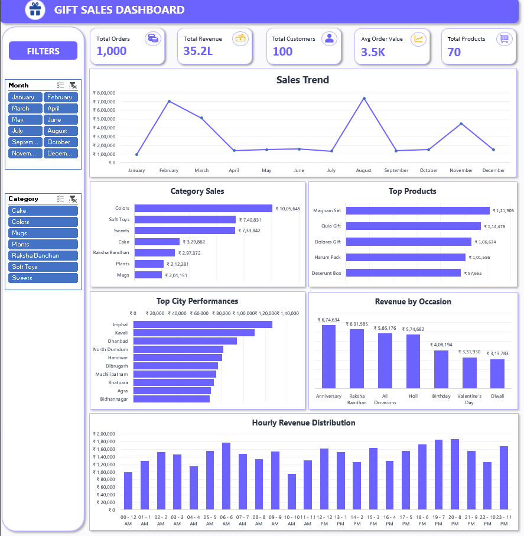
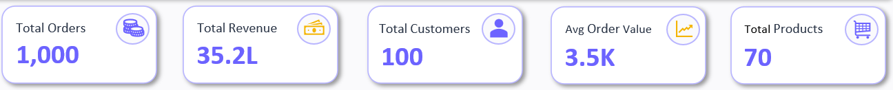
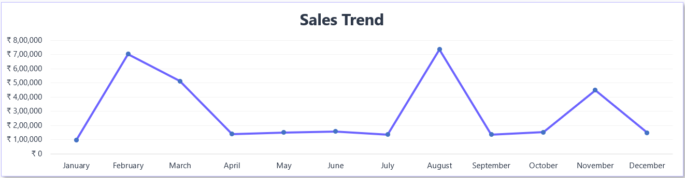
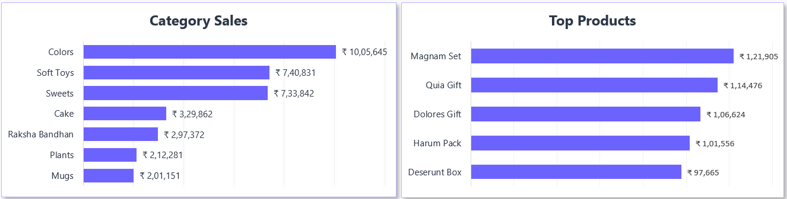
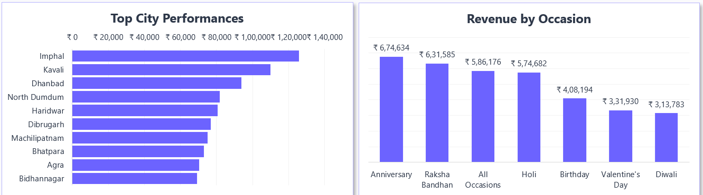
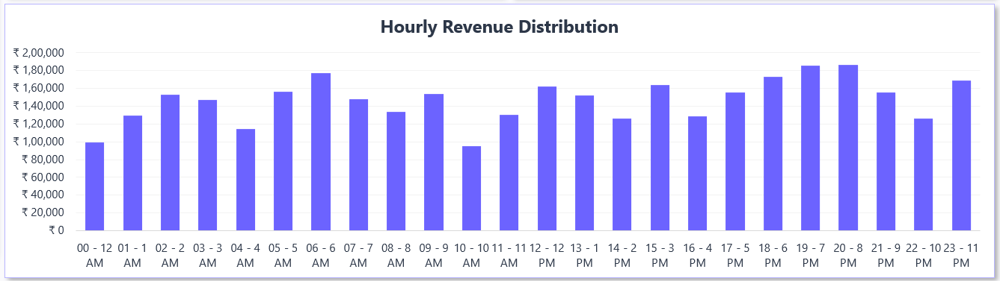

# Gift Sales Dashboard

## Project Overview

This project is an interactive Excel dashboard designed to analyze gift sales performance across products, occasions, cities, and customer purchasing patterns.

The dashboard provides business insights into revenue trends, category performance, top-selling products, regional sales distribution, and hourly purchasing behavior through interactive reporting and visual analytics.

The objective of this project was to practice sales analysis, dashboard design, KPI reporting, and business storytelling using Microsoft Excel.

---

# Objectives

- Monitor overall sales performance
- Identify top-performing gift categories
- Analyze product-level revenue contribution
- Evaluate city-wise sales performance
- Understand seasonal and occasion-based demand
- Examine hourly purchasing behavior
- Build an interactive business dashboard

---

# Dataset Information

The dataset contains gift sales transaction data including:

- Order Information
- Revenue Metrics
- Product Categories
- Product Names
- Occasion Details
- City Information
- Order Dates
- Time-Based Sales Data

---

# Tools & Features Used

- Microsoft Excel
- Pivot Tables
- Pivot Charts
- Slicers
- KPI Cards
- Interactive Dashboard Design
- Business Reporting
- Sales Trend Analysis

---

# Business Questions Explored

- How does revenue vary across months?
- Which gift categories generate the highest sales?
- Which products contribute most to revenue?
- Which cities perform best?
- Which occasions drive customer purchases?
- During which hours does revenue peak?

---

## Main Dashboard

**Insight:** The dashboard provides a consolidated view of sales performance, product demand, regional contribution, and customer purchasing patterns.

## KPI Overview

**Insight:** The business recorded 1,000 orders generating ₹35.2L in revenue, with an average order value of ₹3.5K across 70 products.

## Sales Trend Analysis

**Insight:** Sales revenue experienced noticeable peaks during select months, indicating strong seasonal demand and gift-buying trends.

## Category & Product Analysis

**Insight:** Colors, Soft Toys, and Sweets generated the highest category revenue, while a few top-performing products contributed significantly to overall sales.

## City & Occasion Analysis

**Insight:** Revenue was concentrated in a handful of high-performing cities, with Anniversary and Raksha Bandhan emerging as the strongest sales-driving occasions.

## Hourly Revenue Analysis

**Insight:** Customer purchases were more frequent during afternoon and evening hours, resulting in higher revenue generation later in the day.

# Dashboard Features

- Interactive filtering with slicers
- KPI-based reporting
- Category and product analysis
- City-wise sales tracking
- Occasion-based revenue analysis
- Hourly sales monitoring
- Trend visualization

---

# Skills Demonstrated

- Data Cleaning
- Dashboard Design
- KPI Development
- Sales Analysis
- Business Reporting
- Data Visualization
- Interactive Reporting
- Data Storytelling

---

# Learning Outcomes

Through this project, I practiced:

- Building executive-style dashboards
- Designing KPI-driven reports
- Performing sales analysis
- Visualizing business performance
- Creating interactive Excel dashboards
- Presenting actionable business insights
