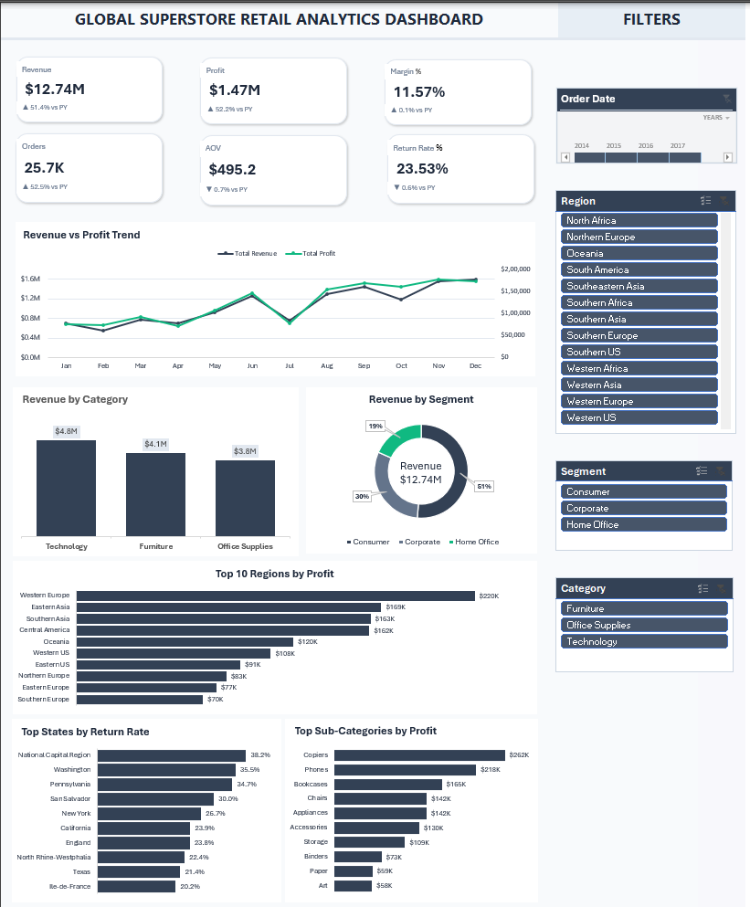
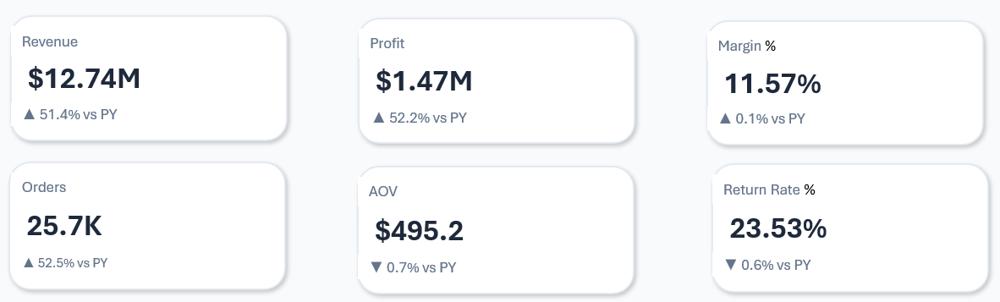
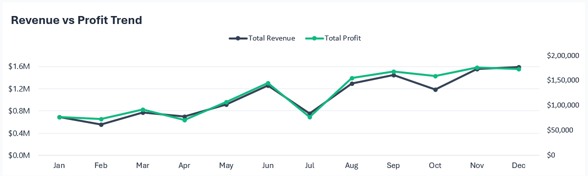
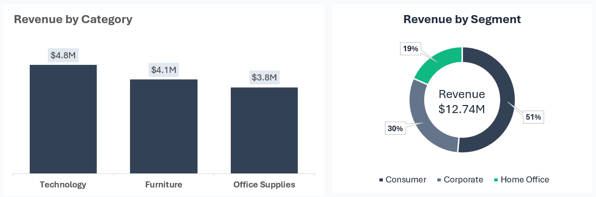
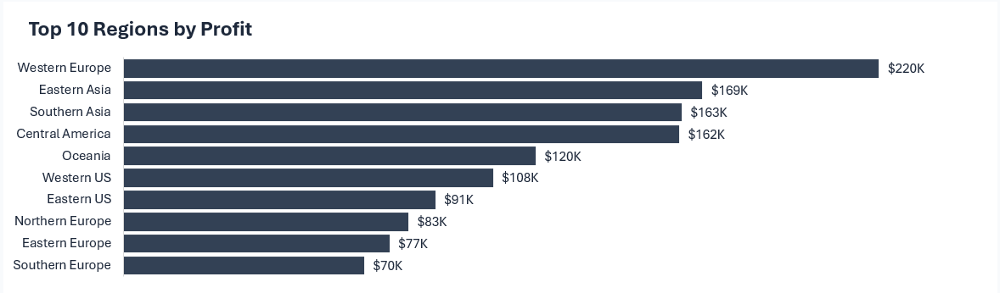
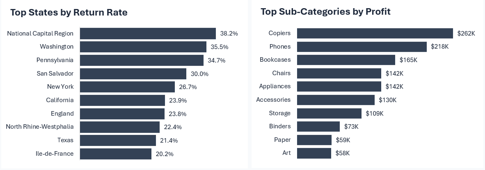

# Global Superstore Retail Analytics Dashboard

## Project Overview

This project is an interactive Excel dashboard designed to analyze sales performance, profitability, customer segments, regional contribution, and product-level profitability across a global retail business.

The dashboard transforms transactional data into executive-level insights through KPI reporting, profitability analysis, regional performance tracking, return analysis, and product performance monitoring.

The objective of this project was to build a business intelligence dashboard that supports data-driven decision-making using Microsoft Excel.

---

# Objectives

- Monitor revenue and profit performance
- Evaluate profit margins and return rates
- Analyze customer segment contribution
- Identify top-performing regions
- Measure category and sub-category profitability
- Track revenue and profit trends over time
- Build an executive-style retail analytics dashboard

---

# Dataset Information

The dataset contains global retail transaction data including:

- Orders
- Revenue
- Profit
- Customer Segments
- Product Categories
- Product Sub-Categories
- Regions
- Return Information
- Order Dates

---

# Tools & Features Used

- Microsoft Excel
- Pivot Tables
- Pivot Charts
- Slicers
- KPI Cards
- Conditional Formatting
- Interactive Dashboard Design
- Profitability Analysis
- Business Reporting

---

# Business Questions Explored

- How has revenue and profit changed over time?
- Which categories generate the most revenue?
- Which customer segments contribute most to sales?
- Which regions generate the highest profits?
- Which states experience the highest return rates?
- Which product sub-categories are the most profitable?
- How effectively is the business maintaining profit margins?

---

# Dashboard Preview

## Main Dashboard

**Insight:** The dashboard provides a consolidated view of revenue, profitability, customer segments, returns, and regional performance across the global retail business.

---

## KPI Overview

**Insight:** The business generated $12.74M in revenue and $1.47M in profit while maintaining an 11.57% profit margin across 25.7K orders.

---

## Revenue & Profit Analysis

**Insight:** Revenue and profit followed similar growth patterns throughout the year, with stronger performance observed during the final quarter.

---

## Category & Segment Analysis

**Insight:** Technology generated the highest revenue, while the Consumer segment contributed more than half of total sales.

---

## Regional Profit Analysis

**Insight:** Profitability was concentrated in a small number of regions, with Western Europe emerging as the top-performing market.

---

## Returns & Sub-Category Analysis

**Insight:** Copiers and Phones generated the highest profits, while several regions experienced elevated return rates that may impact overall profitability.

---

# Dashboard Features

- Interactive filtering using slicers
- KPI-driven business reporting
- Revenue and profit monitoring
- Segment analysis
- Regional profitability tracking
- Return rate analysis
- Product profitability analysis
- Trend visualization

---

# Skills Demonstrated

- Data Cleaning
- Dashboard Design
- KPI Development
- Retail Analytics
- Profitability Analysis
- Business Reporting
- Data Visualization
- Interactive Reporting
- Data Storytelling

---

# Learning Outcomes

Through this project, I practiced:

- Building executive-level dashboards
- Analyzing retail sales performance
- Tracking profitability metrics
- Creating KPI-driven reports
- Developing business insights from transactional data
- Presenting complex data through interactive dashboards
